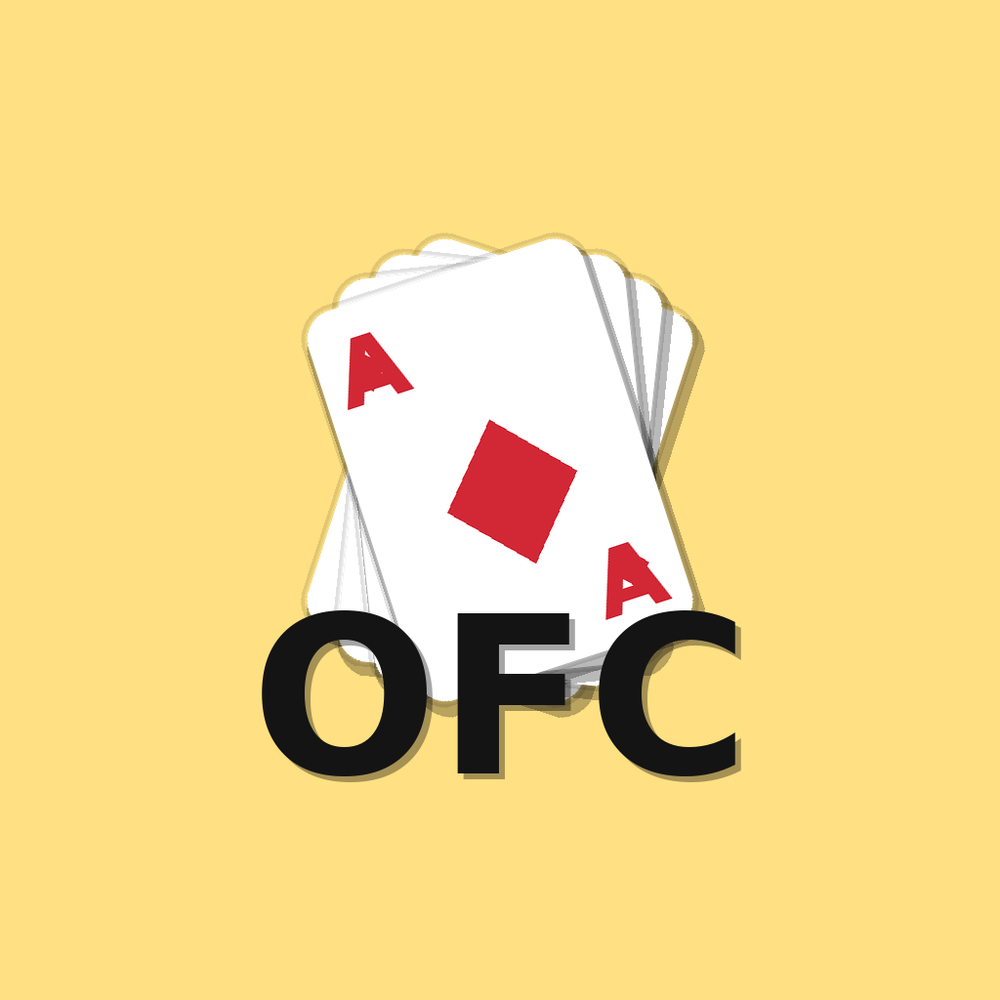

# Open Face Chinese Poker (OFCP) — Flutter/Dart

<p align="center">
  
</p>

<p align="center">
  A cross‑platform implementation of Open Face Chinese Poker (Pineapple variant) built with Flutter (app) and pure Dart (domain). 
</p>

This repository contains the scoring rules, foul detection, Fantasy mode logic, and a minimal playable UI for:

- Practice (single player)
- Pass & Play (A/B hot‑seat)

The codebase emphasizes testable, pure‑Dart domain logic and a thin UI layer.

## Features
- Domain
  - Hand evaluation (5‑card, 3‑card), score engine, royalties, strict foul detection
  - Pineapple flow (initial 5, then 3→place 2→auto‑discard 1)
  - Fantasy mode (enter/continue rules; FOUL cancels Fantasy)
- UI
  - Drag & drop placement, tray return, vertical Top/Middle/Bottom layout
  - Unitary primary button (Next 3 / Commit) + Sort (Fantasy only)
  - Result screens with final boards, FOUL/OK, royalties breakdown, action log
- Tooling & CI
  - Makefile tasks for analyze/test/build/run
  - GitHub Actions: Dart/Flutter analyze, test, bundle build (with pub cache)

## Repository Layout
```
├─ lib/                       # Pure Dart domain logic
│  ├─ core/models/            # Rank, Suit, PlayingCard, Deck
│  └─ features/game/domain/   # hand_evaluator, ruleset, foul_checker,
│                             # score_engine, fantasy_engine, pineapple_engine,
│                             # cycle_logic, board, board_builder, game_state
├─ app/                       # Flutter app (Android/iOS only)
│  └─ lib/                    # main.dart, game_screen.dart, pass_play_screen.dart, result screens
├─ docs/                      # rdd.md (requirements), todo.md (status)
├─ test/                      # Domain unit tests
├─ .github/workflows/ci.yml   # CI pipelines
└─ Makefile                   # Developer tasks
```

## Requirements
- Flutter stable (3.35+) and Dart (3.9+)
- Android Studio (Android SDK) and/or Xcode (iOS) for device builds

## Quick Start
```
# Run all checks
make ci

# App (simulator/device)
make app-run DEVICE="iPhone 15"   # or an Android device id

# Lint / Test / Build
make analyze
make test
make build
```

On iOS devices, enable automatic signing in Xcode:
- open the workspace: `make app-ios-open`
- Xcode → Signing & Capabilities → select your Team (Apple ID)

## Usage Notes (Gameplay)
- Practice: opens a single‑player board. Drag from the tray onto Top/Middle/Bottom. Next 3 becomes enabled after 2 placements (post‑initial), remaining one card auto‑discards.
- Pass & Play: A gets 5 → B gets 5 → A Next 3 → B Next 3 (alternating). If one player is in Fantasy, three‑card deals are skipped for that player.
- Result: shows both final boards, FOUL/OK, royalties, totals, and the intra‑hand action log.

### Practice のシード選択（練習用の再現性）
- トップ画面で「Practice」を押すと、開始前にシード選択モーダルが表示されます。
  - 「ランダム」: 端末時刻由来の整数シードを自動採用。
  - 「指定する」: 任意の整数シードを入力して固定化（同じシードで同じ配札順）。
- 画面上部および結果画面に `Seed: <数値>` を表示します。シードを共有すると、同じ練習手順を他端末でも再現可能です。
- セッション中は同一シードを維持します。ハンドごとに変えたい場合は、要件に応じて切替UIの追加をご検討ください。

## Testing
- Domain tests (pure Dart): `dart test -r expanded`
- App widget smoke tests: `cd app && flutter test -r expanded`

Domain logic is kept deterministic; UI tests focus on smoke/critical flows.

## CI
- GitHub Actions runs on push/PR to `main`/`master`:
  - Dart: `dart analyze`, `dart test`
  - Flutter (app): `flutter analyze`, `flutter test`, `flutter build bundle`
  - Pub cache is enabled to speed up builds

## Contributing
- Follow Conventional Commits (e.g., `feat(game): unify next3 button`)
- Keep PRs small, with description, screenshots for UI, and green CI
- See AGENTS.md for structure, style, and day‑to‑day commands

## Security
- Do not commit secrets. For iOS signing use Xcode’s automatic provisioning locally.
- Please open a private issue or contact maintainers for sensitive reports.

## Roadmap (short)
- A/B result details (row‑by‑row table), pass&play privacy blur
- Golden/Property tests for hand compare regressions
- App icons / splash, basic i18n (EN/JA)

## License
Choose and add a LICENSE file before publishing (MIT recommended). Update this section accordingly.

## Acknowledgements
- Flutter and Dart teams, and the OSS ecosystem
- Playing‑card ranking conventions inspired by standard poker hand rules
